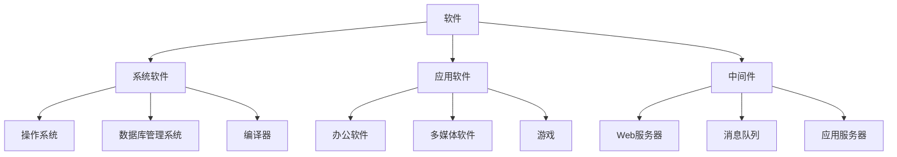
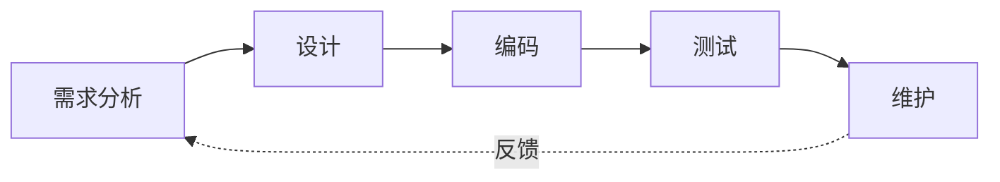

# [0005. 软件与程序](https://github.com/tnotesjs/TNotes.c-cpp/tree/main/notes/0005.%20%E8%BD%AF%E4%BB%B6%E4%B8%8E%E7%A8%8B%E5%BA%8F)

<!-- region:toc -->

- [1. 🎯 本节内容](#1--本节内容)
- [2. 🫧 评价](#2--评价)
- [3. 🤔 什么是计算机硬件？](#3--什么是计算机硬件)
- [4. 🤔 什么是计算机程序？](#4--什么是计算机程序)
- [5. 🤔 什么是计算机软件？](#5--什么是计算机软件)
- [6. 🆚 程序 vs 软件](#6--程序-vs-软件)
- [7. 🤔 程序有哪些分类？](#7--程序有哪些分类)
  - [7.1. 系统程序](#71-系统程序)
  - [7.2. 应用程序](#72-应用程序)
- [8. 🤔 软件有哪些分类？](#8--软件有哪些分类)
  - [8.1. 按功能分类](#81-按功能分类)
    - [系统软件](#系统软件)
    - [应用软件](#应用软件)
    - [中间件](#中间件)
  - [8.2. 按开发语言分类](#82-按开发语言分类)
- [9. 🤔 什么是程序设计？](#9--什么是程序设计)
- [10. 🤔 程序设计包含哪些阶段？](#10--程序设计包含哪些阶段)
  - [10.1. 需求分析（Analysis）](#101-需求分析analysis)
  - [10.2. 设计（Design）](#102-设计design)
  - [10.3. 编码（Code）](#103-编码code)
  - [10.4. 测试（Test）](#104-测试test)
  - [10.5. 维护（Maintain）](#105-维护maintain)
- [11. 💡 实践练习](#11--实践练习)
  - [11.1. 韩信点兵](#111-韩信点兵)
  - [11.2. 奖金计算](#112-奖金计算)
  - [11.3. 汉诺塔游戏](#113-汉诺塔游戏)
- [12. 🔗 引用](#12--引用)

<!-- endregion:toc -->

## 1. 🎯 本节内容

- 计算机硬件的基本概念
- 程序与软件的定义
- 程序的分类（系统程序、应用程序）
- 软件的分类（系统软件、应用软件、中间件）
- 程序设计的五个阶段

## 2. 🫧 评价

这是学习编程前必须了解的基础概念。初学者常混淆程序和软件的关系，实际上软件是程序加文档的集合。理解程序设计的完整流程（需求分析、设计、编码、测试、维护）比单纯学习语法更重要，这决定了你能否开发出真正可用的软件。硬件是基础，程序是指令，软件是产品，程序设计是方法论。

## 3. 🤔 什么是计算机硬件？

计算机硬件（Hardware）是指计算机系统中由电子、机械和光电元件等组成的各种物理装置的总称。

硬件是计算机系统的物理基础，包含：

- 中央处理器（CPU）
- 内存（RAM）
- 硬盘（存储设备）
- 显卡
- 主板
- 输入设备（键盘、鼠标）
- 输出设备（显示器、打印机）

硬件提供计算能力和存储能力，但需要软件来驱动和控制。

## 4. 🤔 什么是计算机程序？

计算机程序（Program）是为实现特定目标或解决特定问题而用计算机语言编写的命令序列的集合，是为实现预期目的而进行操作的一系列语句和指令。

程序的本质是：

- 一组按特定顺序排列的指令
- 告诉计算机如何完成某项任务
- 由源代码编译或解释后才能执行

简单示例：

```c
#include <stdio.h>

int main() {
    printf("Hello, World!\n"); // 输出语句
    return 0;
}
```

这段代码就是一个简单的程序，它的目的是在屏幕上输出一行文字。

## 5. 🤔 什么是计算机软件？

计算机软件（Software）是一系列按照特定顺序组织的计算机数据和指令的集合，简单来说软件就是程序加文档的集合体。

软件不仅包括可以在计算机上运行的程序，与这些程序相关的文档（如用户手册、技术说明、设计文档等）也被认为是软件的一部分。

常见的软件类型：

- 浏览器（Chrome、Firefox、Safari）
- 聊天软件（微信、QQ、Telegram）
- 影音播放器（VLC、网易云音乐）
- 游戏（王者荣耀、原神）
- 办公软件（Word、Excel、PowerPoint）
- 开发工具（VS Code、Visual Studio）

::: tip

提示要开发出复杂、美观的软件或游戏，需要学习更多课程，包括数据结构、算法、图形学、数据库、操作系统、计算机网络等。

:::

## 6. 🆚 程序 vs 软件

| 特性     | 程序                   | 软件                         |
| -------- | ---------------------- | ---------------------------- |
| 定义     | 指令和语句的集合       | 程序加文档的集合             |
| 组成     | 源代码、可执行文件     | 程序、文档、配置文件、资源等 |
| 范围     | 较窄                   | 较广                         |
| 可运行性 | 可直接执行             | 需要完整安装和配置           |
| 维护性   | 只关注功能实现         | 包含使用说明和维护文档       |
| 示例     | 一个 `.exe` 可执行文件 | 完整的应用程序安装包         |
| 关系     | 软件的核心组成部分     | 包含程序的更大集合           |

简单理解：程序是软件的核心部分，软件是程序的完整交付形式。

## 7. 🤔 程序有哪些分类？

计算机程序主要分为两大类：

### 7.1. 系统程序

系统程序用于管理、维护计算机系统，为应用程序提供运行环境。

典型的系统程序：

- 操作系统（Windows、macOS、Linux）
- 设备驱动程序
- 编译器和解释器
- 系统工具（磁盘管理、任务管理器）

### 7.2. 应用程序

应用程序是为解决特定应用问题而编写的程序。

典型的应用程序：

- 办公软件
- 图像处理软件
- 视频播放器
- 游戏
- 浏览器

::: tip

区分要点系统程序服务于计算机系统本身，应用程序服务于用户的具体需求。

:::

## 8. 🤔 软件有哪些分类？

软件可以从不同维度进行分类：

### 8.1. 按功能分类

#### 系统软件

管理和控制计算机硬件，为应用软件提供运行环境。

- 操作系统（Windows、Linux、macOS）
- 数据库管理系统（MySQL、Oracle）
- 编译器（GCC、Clang、MSVC）

#### 应用软件

面向用户的特定应用需求。

- 办公软件（Microsoft Office、WPS）
- 多媒体软件（Photoshop、Premiere）
- 娱乐软件（游戏、音乐播放器）

#### 中间件

介于系统软件和应用软件之间的软件。

- Web 服务器（Apache、Nginx）
- 消息队列（RabbitMQ、Kafka）
- 应用服务器（Tomcat、WebLogic）

### 8.2. 按开发语言分类

- C/C++ 软件
- Java 软件
- Python 软件
- JavaScript 软件

软件分类关系图：



## 9. 🤔 什么是程序设计？

计算机程序设计（Programming）是指给出解决特定问题程序的方法和过程，是软件构造活动的重要组成部分。

程序设计的核心要素：

- 确定要解决什么问题（What）
- 设计如何解决问题（How）
- 选择合适的编程语言实现
- 生成必要的文档资料

程序设计不仅仅是编写代码，而是一个系统化的工程过程，需要考虑需求分析、设计、实现、测试和维护的完整生命周期。

## 10. 🤔 程序设计包含哪些阶段？

程序设计是一个系统化的过程，应当包括五个阶段：



### 10.1. 需求分析（Analysis）

核心问题：What to do?（做什么）

- 理解用户需求
- 明确软件功能
- 确定输入输出
- 分析可行性

产出物：需求规格说明书

### 10.2. 设计（Design）

核心问题：How to do?（怎么做）

- 总体设计（系统架构）
- 详细设计（算法、数据结构）
- 界面设计
- 数据库设计

产出物：设计文档、流程图、UML 图

### 10.3. 编码（Code）

核心问题：实现设计方案

- 选择编程语言
- 编写源代码
- 遵循编码规范
- 进行代码审查

产出物：源代码文件（对 C/C++ 而言是 `.c` 或 `.cpp` 文件）

示例：

```c
// main.c - 源代码文件
#include <stdio.h>

int main() {
    int num;
    printf("请输入一个数字：");
    scanf("%d", &num);
    printf("你输入的是：%d\n", num);
    return 0;
}
```

### 10.4. 测试（Test）

核心问题：程序是否正确

- 单元测试
- 集成测试
- 系统测试
- 验收测试

产出物：可执行文件（对 C/C++ 而言是 `.exe` 文件）、测试报告

编译运行：

```bash
gcc main.c -o main.exe  # 编译生成可执行文件
./main.exe              # 运行程序
```

### 10.5. 维护（Maintain）

核心问题：持续改进

- 修复 bug
- 功能升级
- 性能优化
- 适应环境变化

产出物：更新版本、维护日志

::: warning

注意维护阶段往往占据软件生命周期的大部分时间，重要性不容忽视。

:::

## 11. 💡 实践练习

以下是三个经典的编程练习题，涉及后续将学习的知识点。

### 11.1. 韩信点兵

问题描述：

韩信点兵，又称中国剩余定理问题。已知某个数除以 3 余 2，除以 5 余 3，除以 7 余 2，求这个数的最小值。

涉及知识点：

- 循环结构
- 条件判断
- 模运算

参考思路：

```c
#include <stdio.h>

int main() {
    int num = 0;

    // 从0开始遍历，找到满足条件的最小数
    while (1) {
        if (num % 3 == 2 && num % 5 == 3 && num % 7 == 2) {
            printf("最小值是：%d\n", num);
            break;
        }
        num++;
    }

    return 0;
}
```

### 11.2. 奖金计算

问题描述：

企业根据利润发放奖金，利润低于或等于 10 万元时，奖金可提 10%；利润高于 10 万元，低于 20 万元时，低于 10 万元的部分按 10% 提成，高于 10 万元的部分，可提成 7.5%；以此类推。输入当月利润，求应发放奖金总数。

涉及知识点：

- 多分支选择结构
- 算术运算
- 输入输出

参考思路：

```c
#include <stdio.h>

int main() {
    double profit, bonus = 0;

    printf("请输入当月利润（万元）：");
    scanf("%lf", &profit);

    if (profit <= 10) {
        bonus = profit * 0.1;
    } else if (profit <= 20) {
        bonus = 10 * 0.1 + (profit - 10) * 0.075;
    } else if (profit <= 40) {
        bonus = 10 * 0.1 + 10 * 0.075 + (profit - 20) * 0.05;
    } else {
        bonus = 10 * 0.1 + 10 * 0.075 + 20 * 0.05 + (profit - 40) * 0.03;
    }

    printf("应发奖金：%.2f 万元\n", bonus);
    return 0;
}
```

### 11.3. 汉诺塔游戏

问题描述：

汉诺塔（Hanoi Tower）是一个经典的递归问题。有三根柱子 A、B、C，A 柱上有 n 个盘子（从上到下由小到大），要求将所有盘子移到 C 柱，每次只能移动一个盘子，且大盘子不能放在小盘子上面。

涉及知识点：

- 递归函数
- 函数调用
- 分治思想

参考思路：

```c
#include <stdio.h>

// 递归函数：将n个盘子从from移动到to，借助aux
void hanoi(int n, char from, char to, char aux) {
    if (n == 1) {
        printf("将盘子 1 从 %c 移动到 %c\n", from, to);
        return;
    }

    hanoi(n - 1, from, aux, to);       // 将n-1个盘子从from移到aux
    printf("将盘子 %d 从 %c 移动到 %c\n", n, from, to);
    hanoi(n - 1, aux, to, from);       // 将n-1个盘子从aux移到to
}

int main() {
    int n;
    printf("请输入盘子数量：");
    scanf("%d", &n);

    printf("\n移动步骤如下：\n");
    hanoi(n, 'A', 'C', 'B');

    return 0;
}
```

:::tip 学习建议这些练习题目前可能无法完全理解，随着后续学习控制结构、函数等知识点，再回过头来实现会更加清晰。:::

## 12. 🔗 引用

- [C 语言中文网 - 什么是程序][1]
- [维基百科 - 计算机程序][2]
- [维基百科 - 软件][3]
- [软件工程 - 软件开发生命周期][4]

[1]: http://c.biancheng.net/view/1702.html
[2]: https://zh.wikipedia.org/wiki/%E8%AE%A1%E7%AE%97%E6%9C%BA%E7%A8%8B%E5%BA%8F
[3]: https://zh.wikipedia.org/wiki/%E8%BD%AF%E4%BB%B6
[4]: https://zh.wikipedia.org/wiki/%E8%BD%AF%E4%BB%B6%E5%BC%80%E5%8F%91%E7%94%9F%E5%91%BD%E5%91%A8%E6%9C%9F
