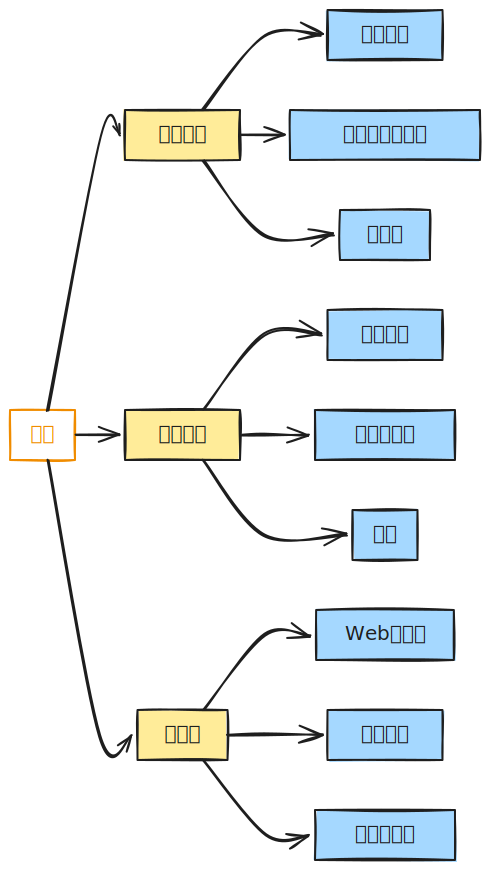

# [0005. 软件与程序](https://github.com/tnotesjs/TNotes.c/tree/main/notes/0005.%20%E8%BD%AF%E4%BB%B6%E4%B8%8E%E7%A8%8B%E5%BA%8F)

<!-- region:toc -->

- [1. 🎯 本节内容](#1--本节内容)
- [2. 🫧 评价](#2--评价)
- [3. 🤔 什么是计算机硬件？](#3--什么是计算机硬件)
- [4. 🤔 什么是计算机程序？](#4--什么是计算机程序)
- [5. 🤔 什么是计算机软件？](#5--什么是计算机软件)
- [6. 🤔 程序有哪些分类？](#6--程序有哪些分类)
  - [6.1. 系统程序](#61-系统程序)
  - [6.2. 应用程序](#62-应用程序)
  - [6.3. 小结](#63-小结)
- [7. 🤔 软件有哪些分类？](#7--软件有哪些分类)
  - [7.1. 按功能分类](#71-按功能分类)
    - [系统软件](#系统软件)
    - [应用软件](#应用软件)
    - [中间件](#中间件)
  - [7.2. 按开发语言分类](#72-按开发语言分类)
  - [7.3. 小结](#73-小结)
- [8. 🤔 什么是程序设计？](#8--什么是程序设计)
- [9. 🤔 程序设计包含哪些阶段？](#9--程序设计包含哪些阶段)
  - [9.1. 需求分析（Analysis）](#91-需求分析analysis)
  - [9.2. 设计（Design）](#92-设计design)
  - [9.3. 编码（Code）](#93-编码code)
  - [9.4. 测试（Test）](#94-测试test)
  - [9.5. 维护（Maintain）](#95-维护maintain)
- [10. 🔗 引用](#10--引用)

<!-- endregion:toc -->

## 1. 🎯 本节内容

- 计算机硬件的基本概念
- 程序与软件的定义
- 程序的分类（系统程序、应用程序）
- 软件的分类（系统软件、应用软件、中间件）
- 程序设计的五个阶段

## 2. 🫧 评价

笔记中记录的这些概念都很基础，在记得在大学里边儿讲解程序设计课程时，最开始接触的就是这些基本概念。

对于这些这些基础概念，你可能会在不同的教程中看到不同的定义，对于这些概念的定义，咱们也不需要过分较真，只需要简单过一遍即可，对实际的开发而言没有太大实际作用。

一句话总结：硬件是基础，程序是指令，软件是产品，程序设计是方法论。

## 3. 🤔 什么是计算机硬件？

计算机硬件（Hardware）是指计算机系统中由电子、机械和光电元件等组成的各种物理装置的总称。

硬件是计算机系统的物理基础，包含：

- 中央处理器（CPU）
- 内存（RAM）
- 硬盘（存储设备）
- 显卡
- 主板
- 输入设备（键盘、鼠标）
- 输出设备（显示器、打印机）
- ……

硬件提供计算能力和存储能力，但需要软件来驱动和控制。

## 4. 🤔 什么是计算机程序？

计算机程序（Program）是为实现特定目标或解决特定问题而用计算机语言编写的命令序列的集合，是为实现预期目的而进行操作的一系列语句和指令。

程序的本质是：

- 一组按特定顺序排列的指令
- 告诉计算机如何完成某项任务
- 由源代码编译或解释后才能执行

简单示例：

```c
#include <stdio.h>

int main() {
    printf("Hello, World!\n"); // 输出语句
    return 0;
}
```

这段代码就是一个简单的程序，它的目的是在屏幕上输出一行文字 `Hello, World!`。

## 5. 🤔 什么是计算机软件？

计算机软件（Software）是一系列按照特定顺序组织的计算机数据和指令的集合，简单来说软件就是程序加文档的集合体。

软件不仅包括可以在计算机上运行的程序，与这些程序相关的文档（如用户手册、技术说明、设计文档等）也被认为是软件的一部分。

常见的软件类型：

- 浏览器（Chrome、Firefox、Safari）
- 聊天软件（微信、QQ、Telegram）
- 影音播放器（VLC、网易云音乐）
- 游戏（王者荣耀、原神）
- 办公软件（Word、Excel、PowerPoint）
- 开发工具（VS Code、Visual Studio）
- ……

::: tip 备注

要开发出复杂、美观的软件或游戏，需要学习更多课程，包括数据结构、算法、图形学、数据库、操作系统、计算机网络等。

:::

## 6. 🤔 程序有哪些分类？

计算机程序主要分为两大类：

### 6.1. 系统程序

系统程序用于管理、维护计算机系统，为应用程序提供运行环境。

典型的系统程序：

- 操作系统（Windows、macOS、Linux）
- 设备驱动程序
- 编译器和解释器
- 系统工具（磁盘管理、任务管理器）
- ……

### 6.2. 应用程序

应用程序是为解决特定应用问题而编写的程序。

典型的应用程序：

- 办公软件
- 图像处理软件
- 视频播放器
- 游戏
- 浏览器
- ……

### 6.3. 小结

- 系统程序服务于计算机系统本身
- 应用程序服务于用户的具体需求

## 7. 🤔 软件有哪些分类？

软件可以从不同维度进行分类：

### 7.1. 按功能分类



#### 系统软件

管理和控制计算机硬件，为应用软件提供运行环境。

- 操作系统（Windows、Linux、macOS）
- 数据库管理系统（MySQL、Oracle）
- 编译器（GCC、Clang、MSVC）
- ……

#### 应用软件

面向用户的特定应用需求。

- 办公软件（Microsoft Office、WPS）
- 多媒体软件（Photoshop、Premiere）
- 娱乐软件（游戏、音乐播放器）
- ……

#### 中间件

介于系统软件和应用软件之间的软件。

- Web 服务器（Apache、Nginx）
- 消息队列（RabbitMQ、Kafka）
- 应用服务器（Tomcat、WebLogic）
- ……

### 7.2. 按开发语言分类

- C/C++ 软件
- Java 软件
- Python 软件
- JavaScript 软件
- ……

### 7.3. 小结

除了上述分类标准之外，软件还有很多其他的分类标准，如按授权方式（开源软件、商业软件）、按部署方式（本地软件、云软件）等。

## 8. 🤔 什么是程序设计？

计算机程序设计（Programming）是指给出解决特定问题程序的方法和过程，是软件构造活动的重要组成部分。

程序设计的核心要素：

- 确定要解决什么问题（What）
- 设计如何解决问题（How）
- 选择合适的编程语言实现
- 生成必要的文档资料
- ……

程序设计不仅仅是编写代码，而是一个系统化的工程过程，需要考虑需求分析、设计、实现、测试和维护的完整生命周期。

## 9. 🤔 程序设计包含哪些阶段？

程序设计是一个系统化的过程，应当包括五个阶段：


### 9.1. 需求分析（Analysis）

核心问题：What to do?（做什么）

- 理解用户需求
- 明确软件功能
- 确定输入输出
- 分析可行性
- ……

产出物：需求规格说明书 -> 好比产品提供的 PRD 文档，描述软件的功能需求、性能需求、用户界面需求等。

### 9.2. 设计（Design）

核心问题：How to do?（怎么做）

- 总体设计（系统架构）
- 详细设计（算法、数据结构）
- 界面设计
- 数据库设计
- ……

产出物：设计文档、流程图、UML 图

### 9.3. 编码（Code）

核心问题：实现设计方案

- 选择编程语言
- 编写源代码
- 遵循编码规范
- 进行代码审查
- ……

产出物：源代码文件（对 C/C++ 而言是 `.c` 或 `.cpp` 文件）

示例：

```c
// main.c - 源代码文件
#include <stdio.h>

int main() {
    int num;
    printf("请输入一个数字：");
    scanf("%d", &num);
    printf("你输入的是：%d\n", num);
    return 0;
}
```

### 9.4. 测试（Test）

核心问题：程序是否正确

- 单元测试
- 集成测试
- 系统测试
- 验收测试

产出物：可执行文件（对 C/C++ 而言是 `.exe` 文件）、测试报告

编译运行：

```bash
gcc main.c -o main.exe  # 编译生成可执行文件
./main.exe              # 运行程序
```

### 9.5. 维护（Maintain）

核心问题：持续改进

- 修复 bug
- 功能升级
- 性能优化
- 适应环境变化

产出物：更新版本、维护日志

注意，维护阶段往往占据软件生命周期的大部分时间，重要性不容忽视。

## 10. 🔗 引用

- [维基百科 - 计算机程序][2]
- [维基百科 - 软件][3]
- [维基百科 - 软件开发生命周期][4]

[2]: https://zh.wikipedia.org/wiki/%E8%AE%A1%E7%AE%97%E6%9C%BA%E7%A8%8B%E5%BA%8F
[3]: https://zh.wikipedia.org/wiki/%E8%BD%AF%E4%BB%B6
[4]: https://zh.wikipedia.org/wiki/%E8%BD%AF%E4%BB%B6%E5%BC%80%E5%8F%91%E7%94%9F%E5%91%BD%E5%91%A8%E6%9C%9F
