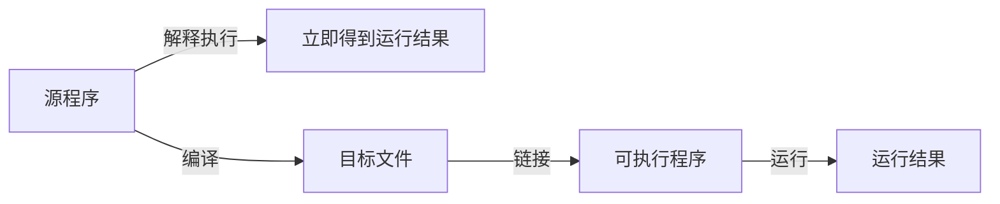

# [0006. 程序设计语言简介](https://github.com/tnotesjs/TNotes.c-cpp/tree/main/notes/0006.%20%E7%A8%8B%E5%BA%8F%E8%AE%BE%E8%AE%A1%E8%AF%AD%E8%A8%80%E7%AE%80%E4%BB%8B)

<!-- region:toc -->

- [1. 🎯 本节内容](#1--本节内容)
- [2. 🫧 评价](#2--评价)
- [3. 🤔 什么是程序设计语言？](#3--什么是程序设计语言)
- [4. 🤔 程序设计语言如何分类？](#4--程序设计语言如何分类)
- [5. 🆚 机器语言 vs 汇编语言 vs 高级语言？](#5--机器语言-vs-汇编语言-vs-高级语言)
- [6. 🤔 高级语言为何被称为面向过程语言？](#6--高级语言为何被称为面向过程语言)
- [7. 🤔 什么是源程序、目标程序和可执行程序？](#7--什么是源程序目标程序和可执行程序)
- [8. 🤔 翻译过程是如何实现的？（解释 vs 编译）](#8--翻译过程是如何实现的解释-vs-编译)
- [9. 🤔 编译过程的详细步骤是什么？](#9--编译过程的详细步骤是什么)
- [10. 🤔 C/C++ 在编程语言谱系中的位置？](#10--cc-在编程语言谱系中的位置)
- [11. 🤔 为什么需要多种编程语言？](#11--为什么需要多种编程语言)

<!-- endregion:toc -->

## 1. 🎯 本节内容

- todo

## 2. 🫧 评价

- todo

## 3. 🤔 什么是程序设计语言？

程序设计语言是一种用来精确描述计算过程的形式化语言，用于把人类的求解思路变成计算机可以执行的指令。

从开发者视角看，程序设计语言至少承担三种角色：

- 交流媒介：把人类对问题求解的思路表达成代码。
- 形式规范：通过严格的语法和语义规则避免歧义。
- 控制硬件：借助编译器或解释器，把代码转换成可在硬件上执行的指令。

一门成熟的程序设计语言通常同时关注下面几个方面：

- 可读性：便于人理解和维护。
- 可表达性：能简洁表达常见的数据结构和算法。
- 可实现性：易于编译成高效、可靠的机器指令。

## 4. 🤔 程序设计语言如何分类？

程序设计语言可以从多个维度进行分类，常见的维度包括：

- 按抽象层次：
  - 机器语言：直接由二进制指令组成，面向硬件。
  - 汇编语言：使用助记符表达指令，需要汇编器翻译成机器码。
  - 高级语言：面向人类表达问题，需要编译或解释后才能执行。
- 按实现方式：
  - 编译型：先整体翻译成目标程序，再运行，如传统的 C 语言、C++。
  - 解释型：运行时逐条分析并执行源代码，如早期的脚本语言。
  - 混合型：编译与解释结合，如先编译为中间表示，再由虚拟机执行。
- 按程序设计思想：
  - 面向过程语言：强调过程与函数的划分。
  - 面向对象语言：强调对象、抽象、继承、多态。
  - 函数式语言：强调函数是一等公民，提倡无副作用。

实际语言往往同时具备多种特征，例如 C++ 既支持面向过程编程，也支持面向对象和一定程度的泛型与函数式风格。

## 5. 🆚 机器语言 vs 汇编语言 vs 高级语言？

从开发者视角比较这三类语言时，可以关注下表中的差异：

| 特性 | 机器语言 | 汇编语言 | 高级语言 |
| --- | --- | --- | --- |
| 可读性 | 极差，二进制难以理解 | 较差，需要熟悉指令集 | 较好，更接近自然语言和数学表达式 |
| 编写效率 | 很低 | 低 | 高 |
| 可移植性 | 几乎没有，绑定具体硬件 | 较差，仍依赖处理器指令集 | 较好，可通过不同编译器适配多种平台 |
| 控制粒度 | 极细粒度，直接操作硬件 | 细粒度，便于精确优化 | 相对粗粒度，由编译器负责底层细节 |
| 典型用途 | 引导程序、固件 | 驱动程序、性能关键内核代码 | 应用程序、库开发、跨平台业务系统 |

在实际工程中，通常只在极少数对性能和资源极端敏感的场景下手写机器语言或汇编语言，绝大多数应用采用高级语言来提高生产力。

## 6. 🤔 高级语言为何被称为面向过程语言？

早期的许多高级语言，如 C，常被称为面向过程语言，是因为它们以过程也就是函数作为组织程序的基本单元。

面向过程语言的典型特点包括：

- 程序被拆分为若干函数或过程，每个函数完成一个相对独立的子任务。
- 数据通常通过参数传递或全局变量在函数之间流动。
- 关注点在于先后执行的步骤，即做什么、以什么顺序做。

与之相比，面向对象语言更强调对象及其状态，把数据和操作封装在一起，通过对象之间的协作来完成任务。现代 C++ 同时支持面向过程和面向对象两种风格。

## 7. 🤔 什么是源程序、目标程序和可执行程序？

在编译型语言的开发流程中，常见的几个概念如下：

- 源程序：由程序设计语言编写的文本文件，例如 C 或 C++ 源文件，通常以 `c` 或 `cpp` 等扩展名结尾。
- 目标程序：由编译器将源程序翻译后生成的中间二进制文件，一般尚未与库链接，不能直接运行。
- 可执行程序：将一个或多个目标程序与所需库链接之后得到的最终二进制文件，可以在操作系统中直接运行。

从开发者编写第一行代码，到用户双击运行，中间就经历了从源程序到目标程序再到可执行程序的转换过程。

## 8. 🤔 翻译过程是如何实现的？（解释 vs 编译）

把源程序变成可以运行的形式，大致有两条路：

- 解释执行：翻译器在程序运行时逐条读取源代码，解析语法，并立即执行对应的操作，不生成独立的可执行文件。
- 预先编译：编译器在运行前一次性把源程序翻译成目标程序或可执行程序，之后的运行过程只依赖生成的二进制文件。

很多现代语言采用的是编译和解释结合的方式，例如先编译为中间表示，再由虚拟机解释或即时编译执行。

下面的图示意性地对比了解释执行和编译执行两种路径：

## 9. 🤔 编译过程的详细步骤是什么？

以 C 语言、C++ 这样的传统编译型语言为例，一个源文件从文本到可执行程序通常要经过以下几个阶段：

1 预处理：

- 处理宏定义、条件编译、头文件包含等指令。
- 输出仍然是文本形式的中间源代码。

2 编译：

- 对经过预处理的源代码进行词法分析、语法分析、语义分析。
- 生成与具体架构相关的中间表示或汇编代码。

3 汇编：

- 将汇编代码转换成机器指令。
- 生成二进制形式的目标文件。

4 链接：

- 把多个目标文件以及标准库或第三方库中的目标代码合并。
- 解决符号引用，最终生成可执行程序或可加载的库文件。

多数编译器会把这些步骤封装在一个命令内部，但理解各阶段的职责有助于排查编译和链接错误。

## 10. 🤔 C/C++ 在编程语言谱系中的位置？

C 和 C++ 在编程语言谱系中大致处于下面的位置：

- 抽象层次上：介于汇编语言和现代高级语言之间，既能贴近硬件，又提供较强的抽象能力。
- 实现方式上：典型的编译型语言，通过编译和链接生成高效的本地机器码。
- 编程范式上：C 偏向面向过程，C++ 在此基础上引入面向对象、泛型编程等多种范式。
- 应用领域上：广泛用于系统软件、编译器、库开发、游戏引擎、高性能服务等对性能和资源有高要求的场景。

可以把 C 看作是许多现代语言的基石，而 C++ 则在兼容 C 的前提下持续扩展语言特性和标准库能力。

## 11. 🤔 为什么需要多种编程语言？

现实世界的计算问题非常多样，一门语言很难在所有维度上同时做到最优，不同语言往往针对不同需求做出权衡。

常见的考量因素包括：

- 性能与资源占用：是否需要尽可能逼近硬件上限。
- 开发效率与可维护性：是否更看重快速交付和易读性。
- 运行环境：是运行在操作系统之上、虚拟机之上，还是直接面向硬件。
- 领域特定需求：是否需要对某个领域提供一流的抽象能力。

因此，工程实践中通常是多种语言协同工作，例如用 C 或 C++ 编写性能关键模块，用更高层的脚本语言编写业务逻辑，再通过接口把各个部分连接起来。
